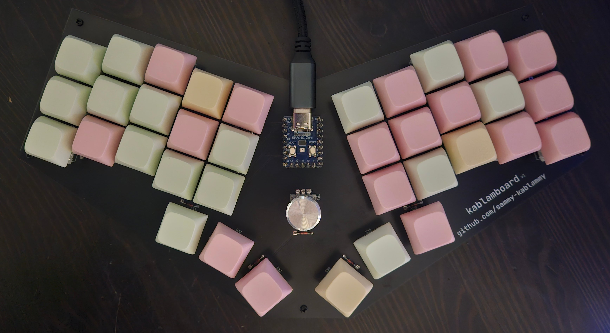
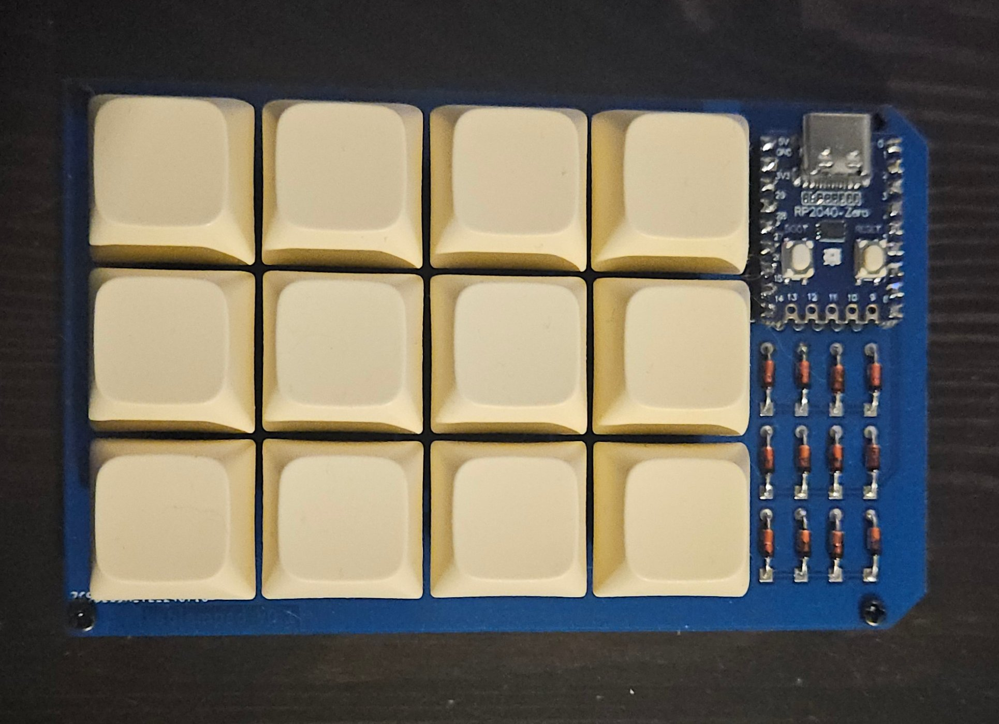

# keyboards

## kablamboard

a 36 key "unibody split" column-staggered ergonomic keyboard

includes a rotary encoder (for funsies!)

based on the RP2040 zero because it's cheap

inspired by
[reviung41](https://github.com/gtips/reviung),
[corne](https://github.com/foostan/crkbd),
[splaytoraid](https://github.com/freya-irl/splaytoraid40),
and [cheapino](https://github.com/tompi/cheapino)

(see *kablamboard* branch)

## kablampad

a 4x3 macropad

my first pcb project

## firmware?

the firmware for all of my keyboards is over in
[my QMK fork](https://github.com/sammy-kablammy/qmk_firmware)
